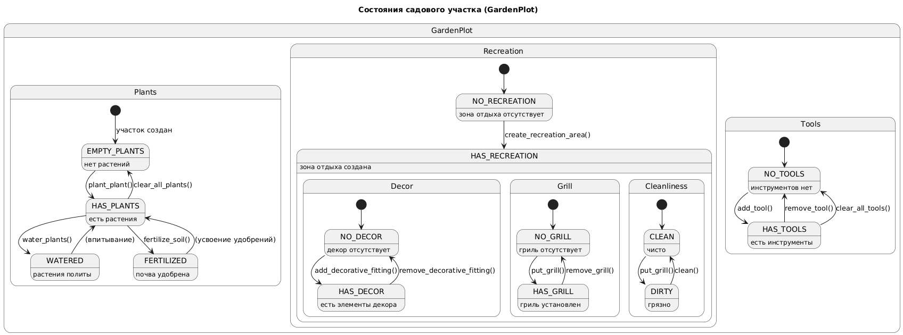

# Лабораторная работа №1

## Вариант: 51

## Тема: Модель садового участка

## Предметная область: управление и облагораживание личного садового участка

## Важные сущности: участок, растения, почва, инструменты, зона отдыха, система полива.

## Операции: 

* операция посадки и ухода за растениями
* операция полива и удобрения
* операция декорирования
* операция обслуживания инструментов
* операция создания зоны отдыха

## Программа

Программа представляет собой модель садового участка, позволяющую пользователю управлять посадкой и уходом за растениями, использовать инструменты, создавать зону отдыха с различными элементами декора, а также автоматизировать полив с помощью системы автоматического полива. Взаимодействие с данной программой осуществляется через консоль.

## Возможности

* Хранить информацию о своей площади, периметре, типе почвы.

* Содержать растения (посадка, удаление, полив, просмотр).

* Складировать садовые инструменты (добавление, удаление, обслуживание, выполнение задач с износом).

* Создавать зону отдыха, добавлять/удалять декоративные элементы, использовать гриль для приготовления мяса.

* Удобрять почву с контролем допустимой нормы удобрений.

* Сохранять и загружать полное состояние участка в JSON-файл.

* Управление участком осуществляется через интерактивное консольное меню. Все команды вводятся цифровыми кодами.

## Основные классы

### GardenPlot (наследует BasicObject)
Класс, моделирующий садовый участок.

#### Атрибуты:
* __soil (почва)
* __irrigation_system (система полива).
* __plants (список растений)
* __tools (список инструментов),
* __recreation_area (зона отдыха).

#### Методы: 
* Посадка/удаление растений
* полив
* удобрение
* управление зоной отдыха
* добавление/удаление инструментов
* обслуживание инструмента.
* работа с данными

### Soil
* Моделирует почву. 
* Хранит тип почвы (SoilType) и текущий коэффициент удобрения. 
* Метод fertilize() увеличивает коэффициент засоления, при превышении лимита выбрасывает исключение BigAmountOfFertilizerError.

### IrrigationSystem
* Система автоматического полива.
* Хранит объём воды, флаг активности. 
* Методы turn_on(), turn_off(), water() (поливает все растения при включённой системе).

### Plant
* Моделирует растение. 
* Включает такие поля как высота, диаметр, название, цвет (объект Color), метку полива и другие методы.

### Tool
* Моделирует инструмент. 
* Имеет название, бренд, описание, состояние (ToolState)и др.
* Методы:
  * perform_task(work_hours) – увеличивает износ, меняет состояние.

  * maintenance() – обслуживание, восстанавливает состояние до хорошего.

## Исключения 

Пакет src.exceptions.exceptions содержит пользовательские исключения для всех ошибок предметной области: 
* **ColorError**
* **PositionError**
* **SystemIsNotActiveError**
* **LackOfWaterError**
* **TooMuchPlantsAreWateredError**
* **BigAmountOfFertilizerError**
* **GrillDoesNotExist**
* **SizeError** и др.

## Диаграмма классов

Диаграмма классов отражает иерархию наследования, композицию и агрегацию между основными компонентами системы. Диаграмма классов данной программы представлена на рисунке 1

Рисунок 1 - диаграмма классов

## Диаграмма состояний

Диаграмма описывает жизненный цикл модели садового участка. На рисунке 2 представлена соответствующая диаграмма состояний.

Рисунок 2 - диаграмма состояний

