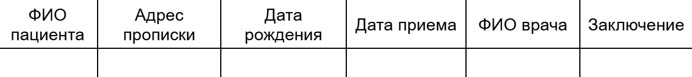

# Лабораторная работа №2

## Вариант: 5

На рисунке 1 представлен вид, в котором должны выводиться записи.


<div align="center">
  Рисунок 1 - вид массива записей.
</div>

## Цель:
* изучить принципы построения графического пользовательского интерфейса;
* разработать программную систему с графическим пользовательским интерфейсом на языке Python.

## Задание
Разработать оконное приложение с одним главным окном и несколькими дочерними диалогами. Вызов диалогов осуществляется через соответствующие пункты меню. Команды меню должны дублироваться на панели инструментов. 


## Программа

Программа представляет собой GUI приложение для ведения отчета об пациентах. В качестве архитектурного решения использовался шаблон MVC (Model-View-Controller). 

## Возможности

* Формируется массив записей путем ввода записей через окно диалога (есть валидация входных данных).

* Показывается количество записей.

* Осуществляется поиск записей в массиве через отдельное диалоговое окно по всем полям таблицы (если была нажата кнопка "Найти", но при этом поля на форме пустые, то пользователю будет выведен весь массив записей).

* Удаляются записи из массива по условиям, указанным в варианте в отдельном диалоговом окне и после сообщает сколько записей было удалено (если была нажата клавиша "Удалить",  то в уведомляющем окне пользователю нужно подтвердить, что он согласен удалить все записи).

* Записи хранятся в базе данных.

* Альтернативное отображение массива записей в виде дерева.

* Сохранять данные в XML файл.

* Загружать данные из XML файла.

* Загружать данные в базу данных из XML файла.

* Пагинация с указанием активной страницы.

* Выбор количества отображаемых записей на одной странице (5, 10, 50, 100, 150)


## Технологии

* SQLAlchemy

* PySide6

* PostgreSQL


## Структура проекта

Структуру проекта можно подробно изучить в файле **structure.txt**

## Описание работы

При запуске программы подльзователя встречает стартовое окно, в котором он может выбрать: 
* выйти из приложения;
* начать работу.

При выборе второго пункта у пользователя есть выбор откуда откуда брать данные: 
* из файла, а именно из любого файла формата xml, с корректными данными, если данные не валидны, или же файл не является файлом с расширением .xml, то пользователь будет уведомлен об ошибке;
* из базы данных.

После загрузки пользователь может выполнять различные действия, все они перечислены в разделе "Возможности".

Также стоит отметить, что при загрузке данных из файла, у пользователя есть возможность сохранить имеющийся массив записей в базу данных, однако, если массив пуст, будет выведено окно с предупреждением.

При нажатии на кнопку *выйти*, пользователь может сохранить текущий массив записей в xml файл, если есть записи.

Пользователь может вернуться обратно для того, чтобы выбрать другой источник загрузки, например, из другого файла.


## Установка для системы Windows

После скачивания папки с исходным кодом проекта необходимо выполнить следущую команду:

```python
$root = $PWD

pyinstaller \
  --onefile \
  --name "medical_app" \
  --windowed \
  --icon="$root/icons/main_ico.ico" \
  --distpath "$root/release/dist" \
  --workpath "$root/release/build" \
  --specpath "$root/release" \
  --add-data "$root/icons:icons" \
  --add-data "$root/ui/main_window.ui:." \
  --add-data "$root/ui/adding_data_window.ui:." \
  --add-data "$root/ui/after_delete_window.ui:." \
  --add-data "$root/ui/confirmation_delete_window.ui:." \
  --add-data "$root/ui/confirmation_to_db_window.ui:." \
  --add-data "$root/ui/delete_window.ui:." \
  --add-data "$root/ui/save_window.ui:." \
  --add-data "$root/ui/search_window.ui:." \
  --hidden-import src.interface.qrc.main_rc \
  --hidden-import src.interface.qrc.main_icons_rc \
  --hidden-import PySide6 \
  --hidden-import PySide6.QtCore \
  --hidden-import PySide6.QtGui \
  --hidden-import PySide6.QtWidgets \
  src/main/main.py
```
 В корне проекта создастся папка *release*, в которой в паке *dist* находиться .exe файл.